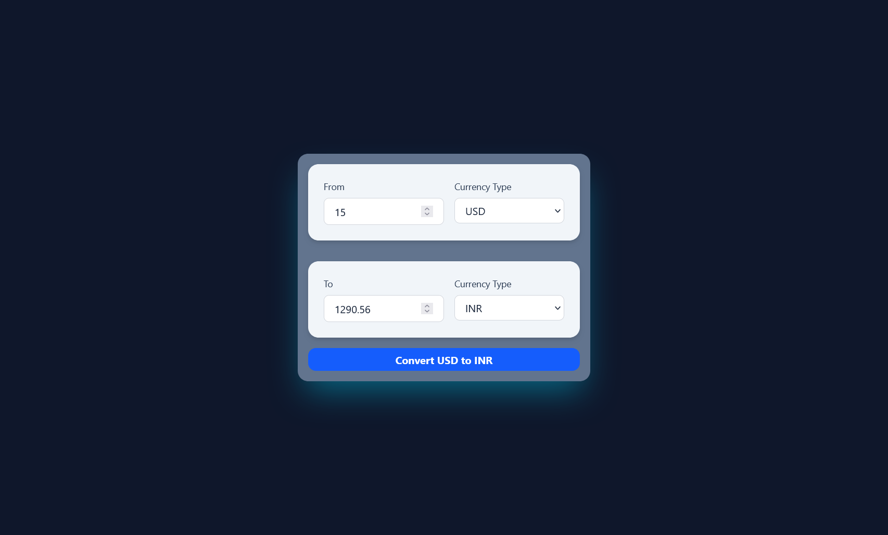

# 💱 Currency Converter

A modern, responsive **Currency Converter** web application built using **React**, **Vite**, and **Tailwind CSS**. This app fetches real-time exchange rates from an external API and allows users to convert between different currencies with ease.

## ✨ Features

-   🌐 **Live Currency Rates** — Fetches up-to-date exchange rates from an external API.
-   🔄 **Bidirectional Conversion** — Convert from any currency to another instantly.
-   🌍 **All Major Currencies Supported** — Supports a wide range of international currencies.
-   ⚡ **Fast Performance** — Powered by Vite for blazing-fast development and build.
-   🎨 **Responsive Design** — Built with Tailwind CSS for a clean and adaptable UI across devices.

## 🛠️ Tech Stack

-   **React** – Frontend library for building the UI
-   **Vite** – Build tool for rapid development
-   **Tailwind CSS** – Utility-first CSS framework for styling
-   **Currency API** – External API to fetch real-time exchange rates

## 📸 Screenshots



## 🚀 Getting Started

### Prerequisites

-   Node.js and npm installed

### Installation

```bash
git clone https://github.com/yourusername/currency-converter.git
cd currency-converter
npm install
```

### Running the App

```bash
npm run dev
```

### Building for Production

```bash
npm run build
```
